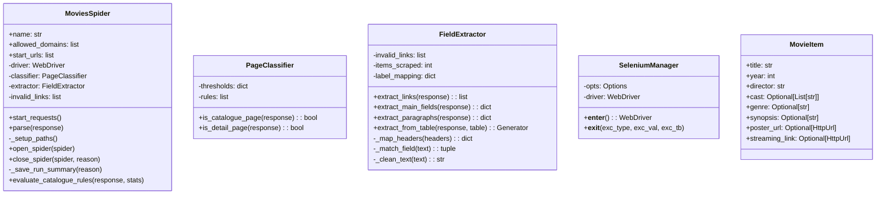
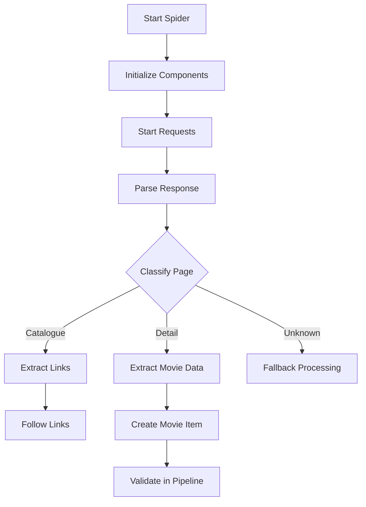
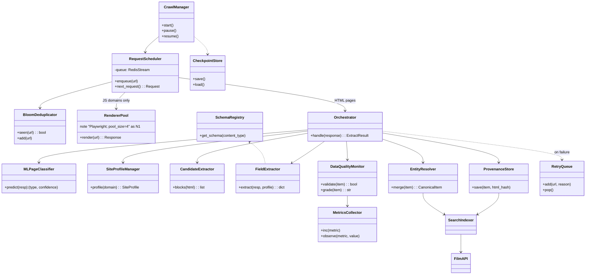
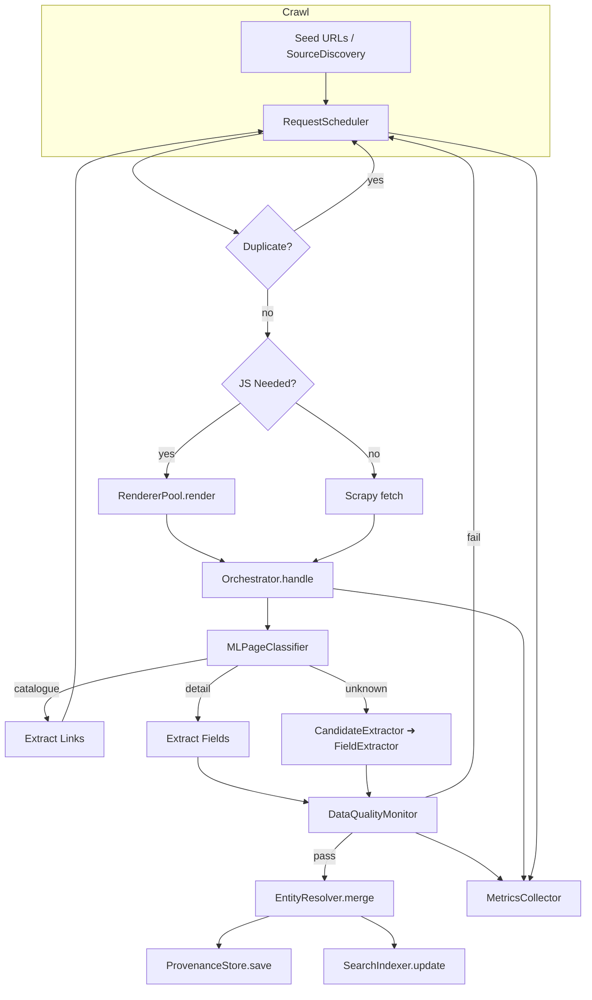

# Burmese Movies Catalogue — System Design (**Version 3 — Requirements‑Aligned**)

> **Purpose**  
> Provide a single, authoritative description of where the crawler *is today* **and** where it is going next.
> This V3 document:
> • captures the **current (baseline) architecture** for context, and
> • details the **next‑generation Architecture V3**, fully aligned with the *BRAWL Web Crawler – Business Requirements & Execution Map*.

---

## Table of Contents

1. [Current Architecture](#1--current-architecture)  
   1.1 [Class Diagram](#11-class-diagram)  
   1.2 [Flow Diagram](#12-flow-diagram)  
   1.3 [Component Descriptions](#13-component-descriptions)  
2. [Requirement Alignment](#2--requirement-alignment)  
3. [Architecture V3 Overview](#3--architecture-v3-overview)  
   3.1 [Key Principles](#31-key-principles)  
   3.2 [Class Diagram](#32-class-diagram)  
   3.3 [Flow Diagram](#33-flow-diagram)  
   3.4 [Component Glossary](#34-component-glossary)  
4. [Deployment & Operations](#4--deployment--operations)  
5. [KPI Instrumentation & Observability](#5--kpi-instrumentation--observability)  
6. [Next Steps](#6--next-steps)

---

## 1 · Current Architecture

> *This section documents the baseline implementation that is live today (pre‑V3). It provides a reference point for measuring progress and identifying technical debt.*

### 1.1 Class Diagram

### 1.2 Flow Diagram

### 1.3 Component Descriptions

| Component           | Role                                                              |
| ------------------- | ----------------------------------------------------------------- |
| **MoviesSpider**    | Main crawl entry‑point; controls lifecycle and page dispatch.     |
| **PageClassifier**  | Determines whether a page is *catalogue*, *detail*, or *unknown*. |
| **FieldExtractor**  | Extracts data via universal selectors + fuzzy matching.           |
| **SeleniumManager** | Provides JS rendering support when necessary.                     |
| **Pipelines**       | Validate and transform items prior to storage/export.             |

> **Limitations Observed**: tightly coupled spider logic, blocking Selenium calls, rule‑only classification prone to drift, no durable queue or provenance store.

---

## 2 · Requirement Alignment

| Requirement Theme                                                                                          | V3 Architectural Response                                                                                                                         |
| ---------------------------------------------------------------------------------------------------------- | ------------------------------------------------------------------------------------------------------------------------------------------------- |
| **Mission & Users** — searchable Burmese film catalogue, export, future API.                               | Public **Film API** (+OpenAPI), **Search Indexer**, and **Editor Dashboard** built on canonical DB.                                               |
| **Content Scope** — films, series, docs, shorts; Unicode/Zawgyi; title‑only allowed; provenance per field. | **Schema Registry** with *Film* schema (modular field set); **Field‑level Provenance Store**; entries support `enrichment_needed`.                |
| **Source Strategy** — curated + auto discovery; multilingual.                                              | **SourceDiscoveryEngine** seeds crawl lists; **SiteProfileManager** holds per‑domain selectors & language hints.                                  |
| **Crawl Strategy** — weekly refresh, 50k+ pages, JS pool, mock mode, dedup, resume, merge.                 | **Durable Queue** (Redis Streams) with **BloomFilter** dedup; **RendererPool** (Playwright, 4 workers); **MOCK\_MODE** path; **CheckpointStore**. |
| **Validation & Enrichment** — accuracy over coverage, human loop, retry queue.                             | **DataQualityMonitor**, **RetryQueue**, **Editor Dashboard**, **EntityResolver** for cross‑source merge.                                          |
| **Compliance** — robots.txt respect, copyright‑safe posters.                                               | **RobotsMiddleware** in Scrapy settings; poster downloads pass through **CopyrightFilter**.                                                       |
| **Extensibility** — future games/tech, modular schema.                                                     | **SchemaRegistry** supports multiple content types (film, game, tech).                                                                            |
| **Deployment** — dev/mock, prod, cron/K8s.                                                                 | Docker images + **GitHub Actions**; cron or K8s `CronJob`; env‑switchable configs.                                                                |
| **Strategies & KPIs** — provenance, breadth over depth, retry, JS allowlist, etc.                          | Each KPI mapped to Prometheus metrics inside **MetricsCollector** (see §5).                                                                       |

---

## 3 · Architecture V3 Overview

### 3.1 Key Principles

1. **Accuracy over coverage** — authoritative sources first; fuzzy merge after.
2. **Provenance everywhere** — every field tagged with source & timestamp.
3. **Cost‑aware rendering** — JS rendering enabled per site profile only.
4. **Resilience & Observability** — durable queues, retry, Prometheus metrics, mock fixtures.
5. **Modular schemas** — ready for games & tech stack expansion.
6. **Human‑in‑the‑loop** — editor dashboard + enrichment tags.
7. **CI Enforced** — site‑profile contract tests & mock‑mode smoke tests in GitHub Actions.

### 3.2 Class Diagram

### 3.3 Flow Diagram

### 3.4 Component Glossary (Key Points Only)

| Component              | Responsibility                                                                                         | Notes & KPIs                                         |
| ---------------------- | ------------------------------------------------------------------------------------------------------ | ---------------------------------------------------- |
| **CrawlManager**       | CLI entrypoint; loads checkpoints; supervises workers.                                                 | Emits `crawl_sessions_total`.                        |
| **RequestScheduler**   | Pulls next URL from Redis Stream; consults Bloom filter; decides JS vs HTML.                           | Tracks `queue_length` & `avg_wait_sec`.              |
| **BloomDeduplicator**  | Global seen‑URL filter (\~1% fp).                                                                      | Supports *Breadth over Depth* strategy.              |
| **RendererPool**       | Playwright pool; headless Chrome; back‑pressure handled via async semaphore.                           | KPIs: `selenium_render_ratio`, `avg_render_time`.    |
| **MLPageClassifier**   | Logistic Reg with TF‑IDF; returns `(type, confidence)`. Falls back to rule heuristics if `conf < 0.6`. | KPI: `classifier_confidence_avg`.                    |
| **SiteProfileManager** | YAML per domain: selectors, JS flag, throttle. CI validates schema.                                    | KPI: `profile_contract_failures`.                    |
| **CandidateExtractor** | Fast regex/text heuristics for unknown pages.                                                          | KPI: `candidate_extractor_hit_rate`.                 |
| **FieldExtractor**     | Maps raw HTML → dict using profile selectors + fallback fuzzy.                                         | Schema‑aware via **SchemaRegistry**.                 |
| **EntityResolver**     | Merges items across sources by title/year (fuzzy) and priority score.                                  | KPIs: `merged_entry_rate`, `avg_sources_per_film`.   |
| **DataQualityMonitor** | Validates required fields, year range, null %. Assigns grade A‑F.                                      | KPIs: `validation_fail_total`, `grade_distribution`. |
| **ProvenanceStore**    | Saves canonical JSON + per‑field source + HTML hash.                                                   | Enables editor audit trail.                          |
| **RetryQueue**         | Redis sorted set; stores URL, retry\_count, last\_error.                                               | KPIs: `retry_success_rate`, `dead_letter_total`.     |
| **MetricsCollector**   | Prometheus bridge; records all KPIs.                                                                   |                                                      |
| **FilmAPI**            | REST `GET /films`, `PATCH /films/:id` (auth required).                                                 | KPI: `film_lookup_response_ms`, `api_uptime`.        |
| **SearchIndexer**      | Typesense or Tantivy; drives frontend search.                                                          | KPI: `index_sync_lag_sec`.                           |
| **SchemaRegistry**     | YAML/JSON Schema per content type (film/game/tech).                                                    | KPI: `schema_validation_errors`.                     |

---

## 4 · Deployment & Operations

| Environment    | Tech                                                                                       | Purpose                                         |
| -------------- | ------------------------------------------------------------------------------------------ | ----------------------------------------------- |
| **Dev (Mock)** | Docker Compose: Playwright, Redis, Postgres, Grafana; `MOCK_MODE=true`.                    | Deterministic local tests & CI.                 |
| **Prod**       | Docker images on VPS or K8s `CronJob`; secrets via GitHub → K8s Secrets.                   | Weekly scheduled crawl; auto‑scaling if needed. |
| Backups        | MinIO / S3 lifecycle rules (compress ≥30 d, delete ≥1 y).                                  | Controls raw‑HTML storage cost.                 |
| CI/CD          | GitHub Actions: linters, site‑profile contract tests, mock smoke test, image build & push. | Fail‑fast guarantee.                            |

---

## 5 · KPI Instrumentation & Observability

All KPIs listed in the *Execution Map* are exported via **MetricsCollector** to Prometheus with labels `project="brawl"`, `content_type`, `domain`, etc. Example mappings:

| KPI (Business)                | Prometheus Metric                     | Type    |
| ----------------------------- | ------------------------------------- | ------- |
| `metadata_certified_rate`     | `brawl_metadata_certified_ratio`      | Gauge   |
| `weekly_title_only_additions` | `brawl_title_only_total{window="7d"}` | Counter |
| `selenium_render_ratio`       | `brawl_selenium_render_ratio`         | Gauge   |
| `retry_success_rate`          | `brawl_retry_success_ratio`           | Gauge   |

Dashboards in Grafana surface **trend lines** and **alert rules** (e.g., validation grade < 90% triggers Opsgenie).

---

## 6 · Next Steps

1. **Implement EntityResolver** with fuzzy‑match + trust‑score logic.
2. **Finish Site Profile Contract Tests** in CI.
3. **Build Editor Dashboard MVP** (Next.js, Chakra UI) consuming Film API.
4. **Wire up KPI dashboards** and alert thresholds.
5. **Add PII Scrubber** to ProvenanceStore pipeline (regex for phone/email).
6. **Pilot Crawl** on 3 curated sources to validate end‑to‑end pipeline.

---

> *Document last updated: 2025‑05‑08 — aligned with Business Requirements v1.1*
