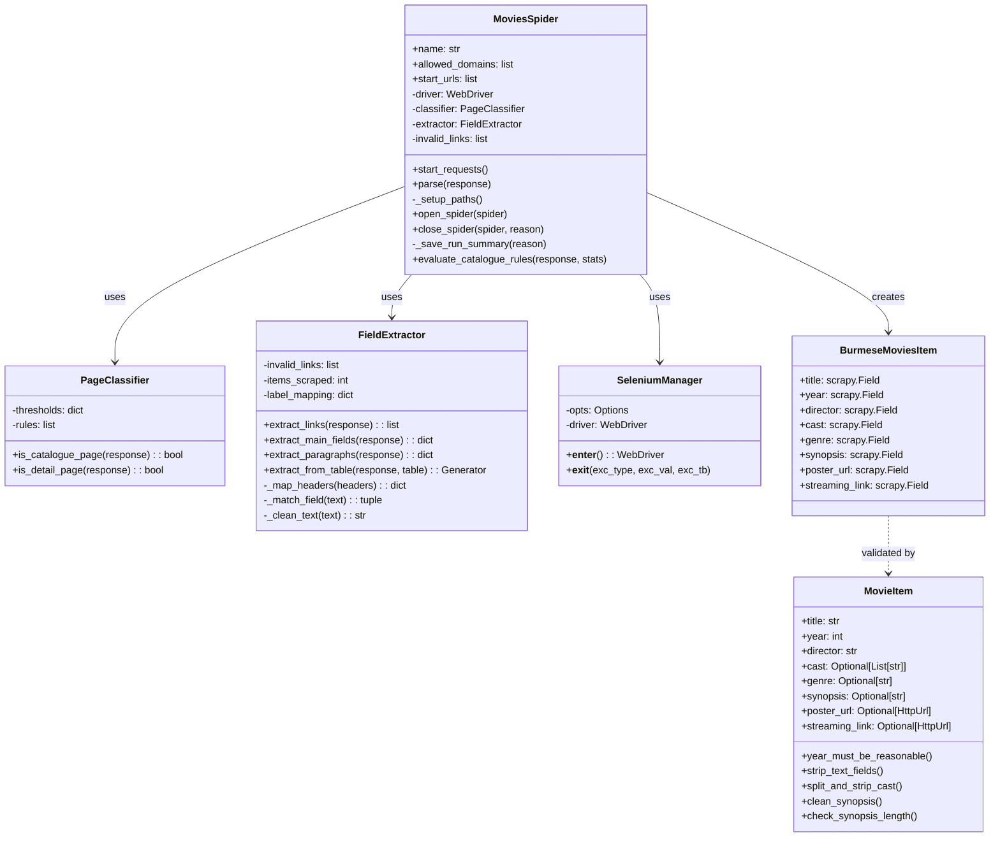
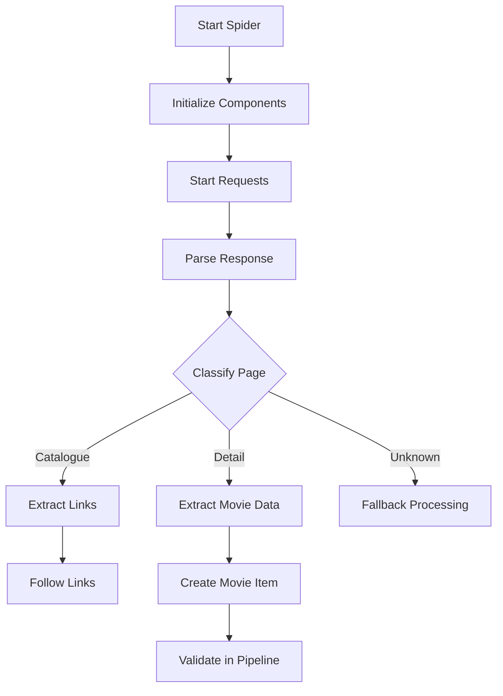
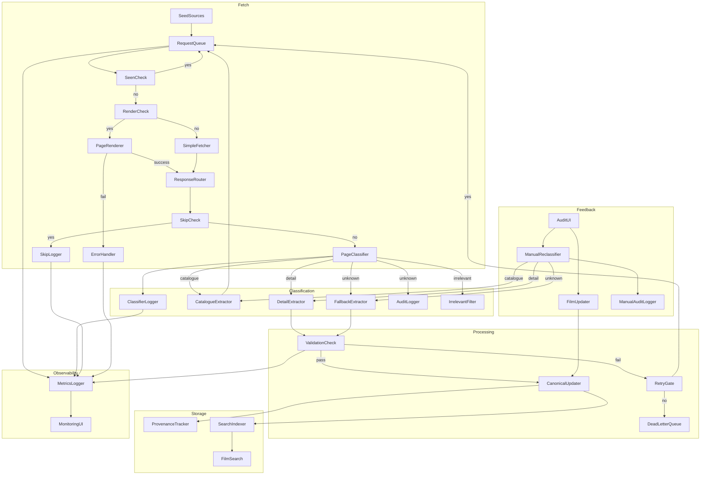
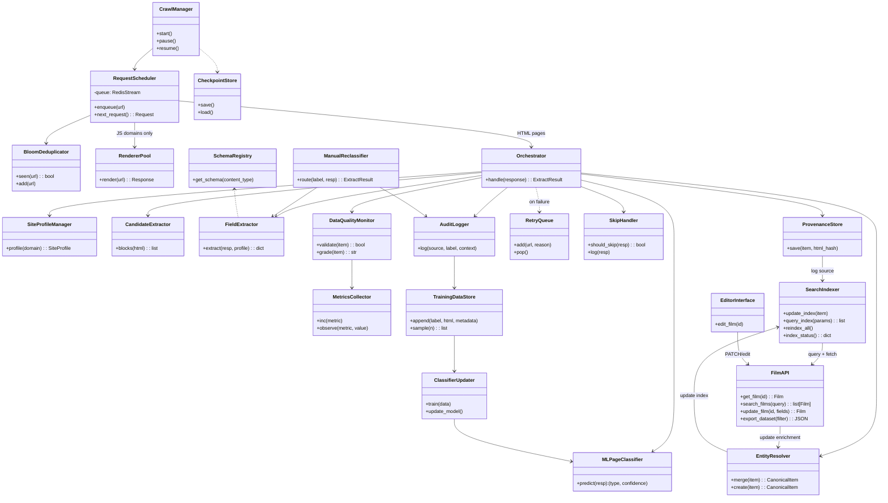

# Burmese Movies Catalogue — System Design

## **Purpose**  

Provide a single, authoritative description of where the crawler *is today* **and** where it is going next.
This architecture document:
- captures the **current (baseline) architecture** for context, and
- details the **next‑generation proposed Architecture**, fully aligned with the [*BRAWL Web Crawler – Requirements & Execution Map*](/docs/requirements_strategy_execution.md).

---

## Table of Contents

1. [Current Architecture](#1--current-architecture)  
   1.1 [Class Diagram](#11-class-diagram)  
   1.2 [Flow Diagram](#12-flow-diagram)  
   1.3 [Component Descriptions](#13-component-descriptions)  
2. [Requirement Alignment](#2--requirement-alignment)  
3. [Proposed Architecture Overview](#3--proposed-architecture-overview)  
   3.1 [Key Principles](#31-key-principles)  
   3.2 [Class Diagram](#32-class-diagram)  
   3.3 [Flow Diagram](#33-flow-diagram)  
   3.4 [Component Glossary](#34-component-glossary)  
4. [Deployment & Operations](#4--deployment--operations)  
5. [KPI Instrumentation & Observability](#5--kpi-instrumentation--observability)  
6. [Next Steps](#6--next-steps)

---

## 1 · Current Architecture

> *This section documents the baseline implementation that is live today. It provides a reference point for measuring progress and identifying technical debt.*

### 1.1 Class Diagram

### 1.2 Flow Diagram

### 1.3 Component Descriptions

| Component           | Role                                                              |
| ------------------- | ----------------------------------------------------------------- |
| **MoviesSpider**    | Main crawl entry‑point; controls lifecycle and page dispatch.     |
| **PageClassifier**  | Determines whether a page is *catalogue*, *detail*, or *unknown*. |
| **FieldExtractor**  | Extracts data via universal selectors + fuzzy matching.           |
| **SeleniumManager** | Provides JS rendering support when necessary.                     |
| **Pipelines**       | Validate and transform items prior to storage/export.             |

> **Limitations Observed**: tightly coupled spider logic, blocking Selenium calls, rule‑only classification prone to drift, no durable queue or provenance store.

---

## 2 · Requirement Alignment

| Requirement Theme                                                                                          | Proposed Architectural Response                                                                                                                         |
| ---------------------------------------------------------------------------------------------------------- | ------------------------------------------------------------------------------------------------------------------------------------------------- |
| **Mission & Users** — searchable Burmese film catalogue, export, future API.                               | Public **Film API** (+OpenAPI), **Search Indexer**, and **Editor Dashboard** built on canonical DB.                                               |
| **Content Scope** — films, series, docs, shorts; Unicode/Zawgyi; title‑only allowed; provenance per field. | **Schema Registry** with *Film* schema (modular field set); **Field‑level Provenance Store**; entries support `enrichment_needed`.                |
| **Source Strategy** — curated + auto discovery; multilingual.                                              | **SourceDiscoveryEngine** seeds crawl lists; **SiteProfileManager** holds per‑domain selectors & language hints.                                  |
| **Crawl Strategy** — weekly refresh, 50k+ pages, JS pool, mock mode, dedup, resume, merge.                 | **Durable Queue** (Redis Streams) with **BloomFilter** dedup; **RendererPool** (Playwright, 4 workers); **MOCK\_MODE** path; **CheckpointStore**. |
| **Validation & Enrichment** — accuracy over coverage, human loop, retry queue.                             | **DataQualityMonitor**, **RetryQueue**, **Editor Dashboard**, **EntityResolver** for cross‑source merge.                                          |
| **Compliance** — robots.txt respect, copyright‑safe posters.                                               | **RobotsMiddleware** in Scrapy settings; poster downloads pass through **CopyrightFilter**.                                                       |
| **Extensibility** — future games/tech, modular schema.                                                     | **SchemaRegistry** supports multiple content types (film, game, tech).                                                                            |
| **Deployment** — dev/mock, prod, cron/K8s.                                                                 | Docker images + **GitHub Actions**; cron or K8s `CronJob`; env‑switchable configs.                                                                |
| **Strategies & KPIs** — provenance, breadth over depth, retry, JS allowlist, etc.                          | Each KPI mapped to Prometheus metrics inside **MetricsCollector** (see §5).                                                                       |

---

## 3 · Proposed Architecture Overview

### 3.1 Key Principles

1. **Accuracy over coverage** — authoritative sources first; fuzzy merge after.
2. **Provenance everywhere** — every field tagged with source & timestamp.
3. **Cost‑aware rendering** — JS rendering enabled per site profile only.
4. **Resilience & Observability** — durable queues, retry, Prometheus metrics, mock fixtures.
5. **Modular schemas** — ready for games & tech stack expansion.
6. **Human‑in‑the‑loop** — editor dashboard + enrichment tags.
7. **CI Enforced** — site‑profile contract tests & mock‑mode smoke tests in GitHub Actions.

### 3.2 Flow Diagram

### 3.3 Class Diagram

### 3.4 Component Glossary

| **Component**        | **Type**                 | **Purpose / Responsibility**                                                   | **Notes**                                                            |
| -------------------- | ------------------------ | ------------------------------------------------------------------------------ | -------------------------------------------------------------------- |
| `SeedSources`        | Fetch                    | Generates the initial seed URLs or discovers new sources to crawl              | Can be hardcoded, sitemap-based, or learned dynamically              |
| `RequestQueue`       | Fetch                    | Manages the queue of pending crawl URLs, ensuring correct scheduling           | Should support priority, deduplication, and checkpointing            |
| `SeenCheck`          | Fetch                    | Checks if a URL has already been crawled                                       | Typically uses a Bloom filter or persistent store                    |
| `RenderCheck`        | Fetch                    | Determines if a page requires JavaScript rendering                             | Rules-based, may evolve to ML-based heuristics                       |
| `PageRenderer`       | Fetch                    | Uses a headless browser (e.g., Playwright) to render JS-heavy pages            | Includes resource blocking, timeout, and concurrency control         |
| `SimpleFetcher`      | Fetch                    | Fetches static HTML pages via lightweight requests (e.g., Scrapy)              | Used when JS is unnecessary                                          |
| `ResponseRouter`     | Fetch                    | Routes rendered/fetched page to downstream logic                               | Handles errors, MIME type checks, and retry classification           |
| `SkipCheck`          | Fetch                    | Filters pages that are empty, redirect, 404, etc.                              | Essential to avoid wasted computation                                |
| `SkipLogger`         | Observability            | Logs skipped or invalid pages for diagnostics                                  | Useful for debugging misrouted or filtered pages                     |
| `PageClassifier`     | Classification           | Predicts page type: `catalogue`, `detail`, `irrelevant`, `unknown`             | ML model trained on prior page features and labels                   |
| `ClassifierLogger`   | Observability            | Logs classifier outputs including prediction, confidence, and features         | Enables audit trails, model monitoring, and drift detection          |
| `CatalogueExtractor` | Classification           | Extracts links to individual movie pages from catalogue-type pages             | Must be robust to noisy, inconsistent layouts                        |
| `DetailExtractor`    | Classification           | Extracts structured film metadata from detail pages (e.g., title, year)        | Relies on field mappings or model-based extractors                   |
| `FallbackExtractor`  | Classification           | Applies heuristics to extract metadata from unknown/unlabeled pages            | Used when classifier is uncertain or wrong                           |
| `AuditLogger`        | Feedback / Observability | Logs all classifier errors and human-labeled overrides                         | Feeds into `TrainingDataStore` for system improvement                |
| `IrrelevantFilter`   | Classification           | Silently drops non-film pages (e.g., login, ads, legal)                        | Critical for efficiency                                              |
| `ValidationCheck`    | Processing               | Validates extracted metadata (e.g., type checks, required fields)              | Uses Pydantic or schema validation                                   |
| `RetryGate`          | Processing               | Determines whether a failed item should be retried or dropped                  | May track retry counts in Redis or DB                                |
| `DeadLetterQueue`    | Processing               | Stores permanently failed extractions for manual analysis                      | Enables recovery, audit, and future retraining                       |
| `CanonicalUpdater`   | Processing               | Merges valid film data into existing canonical entries or creates new ones     | Ensures film identity resolution and deduplication                   |
| `ProvenanceTracker`  | Storage                  | Records where and how data was obtained (URL, HTML hash, classifier version)   | Useful for trust, debugging, and reprocessing                        |
| `SearchIndexer`      | Storage                  | Indexes canonical film records for fast query and search (e.g., ElasticSearch) | Supports frontend or API search                                      |
| `FilmSearch`         | Storage                  | API endpoint or module to retrieve indexed film data                           | Powers public or internal search UIs                                 |
| `MetricsLogger`      | Observability            | Central emitter of metrics from crawl, classification, extraction              | Events include `url_scheduled`, `classifier_miss`, `validation_fail` |
| `MonitoringUI`       | Observability            | Dashboard that visualizes system health and metrics                            | Supports Prometheus, Grafana, or custom stack                        |
| `AuditUI`            | Feedback                 | UI for human reviewers to inspect, validate, and reclassify unknown pages      | Supports page labeling, inline extraction, bulk decisions            |
| `ManualReclassifier` | Feedback                 | Takes human input and routes a page to the appropriate extractor               | Replaces or overrides classifier logic                               |
| `FilmUpdater`        | Feedback                 | Lets users modify canonical film data manually                                 | Useful for error corrections and overrides                           |
| `TrainingDataStore`  | Feedback / Learning      | Stores all human-labeled examples (correct and incorrect) for model retraining | Tracks label source, context, and extraction success                 |
| `ClassifierUpdater`  | Learning                 | Periodically retrains and/or swaps in a new classifier using training data     | Can trigger fine-tuning or full model replacement                    |

---

## 4 · Deployment & Operations

| Environment    | Tech                                                                                       | Purpose                                         |
| -------------- | ------------------------------------------------------------------------------------------ | ----------------------------------------------- |
| **Dev (Mock)** | Docker Compose: Playwright, Redis, Postgres, Grafana; `MOCK_MODE=true`.                    | Deterministic local tests & CI.                 |
| **Prod**       | Docker images on VPS or K8s `CronJob`; secrets via GitHub → K8s Secrets.                   | Weekly scheduled crawl; auto‑scaling if needed. |
| Backups        | MinIO / S3 lifecycle rules (compress ≥30 d, delete ≥1 y).                                  | Controls raw‑HTML storage cost.                 |
| CI/CD          | GitHub Actions: linters, site‑profile contract tests, mock smoke test, image build & push. | Fail‑fast guarantee.                            |

---

## 5 · KPI Instrumentation & Observability

All KPIs listed in the *Execution Map* are exported via **MetricsCollector** to Prometheus with labels `project="brawl"`, `content_type`, `domain`, etc. Example mappings:

| KPI (Business)                | Prometheus Metric                     | Type    |
| ----------------------------- | ------------------------------------- | ------- |
| `metadata_certified_rate`     | `brawl_metadata_certified_ratio`      | Gauge   |
| `weekly_title_only_additions` | `brawl_title_only_total{window="7d"}` | Counter |
| `selenium_render_ratio`       | `brawl_selenium_render_ratio`         | Gauge   |
| `retry_success_rate`          | `brawl_retry_success_ratio`           | Gauge   |

Dashboards in Grafana surface **trend lines** and **alert rules** (e.g., validation grade < 90% triggers Opsgenie).

---

## 6 · Next Steps

1. **Implement EntityResolver** with fuzzy‑match + trust‑score logic.
2. **Finish Site Profile Contract Tests** in CI.
3. **Build Editor Dashboard MVP** (Next.js, Chakra UI) consuming Film API.
4. **Wire up KPI dashboards** and alert thresholds.
5. **Add PII Scrubber** to ProvenanceStore pipeline (regex for phone/email).
6. **Pilot Crawl** on 3 curated sources to validate end‑to‑end pipeline.

---

> *Document last updated: 2025‑05‑08 — aligned with Business Requirements v1.1*
